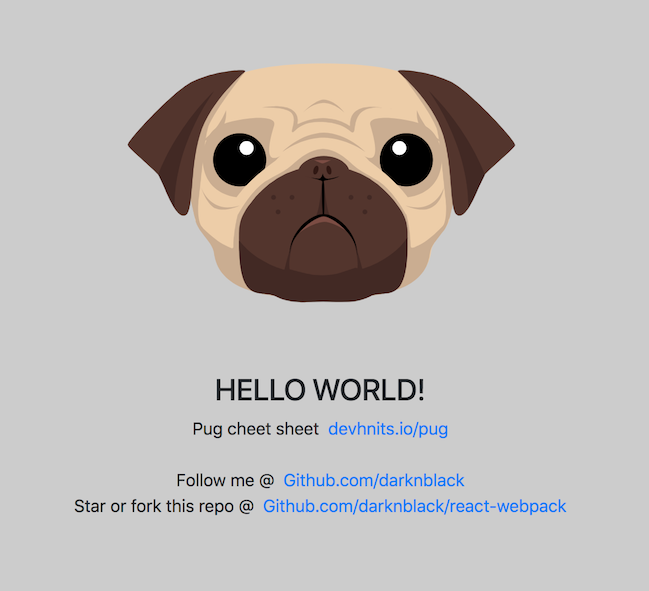

# React Webpack Starter Kit (Fast Development)



### Features
- React `16.5.1` [ with optimizations 15x faster ]
- React-Redux
- Webpack `4`
- Prettier & Eslint [ code formatter & beautify ]
- Babel
- Pug (Optional)
- Bootstrap `4` (Optional)
- SASS & SCSS Loader with css optimization (minify using cssnano)
- Automatic Browser Refresh (`Hot-reload`) on save
- Automatic Syntax Formatter (`Eslint`) on save
- Compression (`Gzip` and `Brotli`) for faster load speed

### Installation

1. Clone the repo `git clone https://github.com/darknblack/react-webpack.git`
2. `npm install` to install npm packages.

### How to use?

- Start dev server using `npm start` or `npm run start`.
- Build `npm run build`.
- Build with (`Gzip` and `Brotli`) compression `npm run build:prod`.

### Test

- Unit testing will watch all your changes in the test files as well as create coverage folder for you.
  `npm run test`

### Project structure

```
Root Directory/
|-- build/
|-- src/
|   |-- index.jsx ______________________________________ # Application entry
|   |-- template.html __________________________________ # Template
|   |-- reducer.js _____________________________________ # Application init
|   |-- components/
|       |-- body.jsx ___________________________________ # Sample component
|   |-- css/
|       |-- style.sass _________________________________ # Sample style (css,sass,scss)
|   |-- images/
|       |-- pug.svg ____________________________________ # Sample image (image file)
|
|-- config/
|   |-- paths.js _______________________________________ # Paths config
|   |-- webpack.config.js ______________________________ # Main webpack
|   |-- webpack.common.js ______________________________ # Common webpack config
|   |-- webpack.dev.js _________________________________ # Webpack development
|   |-- webpack.prod.js ________________________________ # Webpack production
|
|-- setUpTests.js ______________________________________ # Jest-Enzyme config
```

### Configuration
- Path config `config/paths.js`
- `config/webpack.config.js` main webpack config that merge common and webpack based environment.
- `config/webpack.common.js` webpack config for both environments.
- `config/webpack.dev.js` webpack config for devevelopment.
- `config/webpack.prod.js` webpack config for production.
- Enzyme config `/setupTest.js` here you will have all setup for enzyme to test your component.

### Powered by the following:
- [Webpack 4](https://github.com/webpack/webpack)
- [Babel 7](https://github.com/babel/babel)
- [React](https://github.com/facebook/react)
- [Redux](https://github.com/reduxjs/redux)
- [Pug](https://github.com/pugjs)
- [Bootstrap](https://github.com/twbs/bootstrap/tree/v4-dev) ( [Popper](https://popper.js.org) & [Jquery](https://github.com/jquery/jquery) )
- [Lodash](https://github.com/lodash/lodash)
- [Jest](https://github.com/facebook/jest)
- [Enzyme](http://airbnb.io/enzyme/)
- [Eslint](https://github.com/eslint/eslint/)
- [Prettier](https://github.com/prettier/prettier)
- [Style](https://github.com/webpack-contrib/style-loader) & [CSS Loader](https://github.com/webpack-contrib/css-loader) & [SASS-loader](https://github.com/webpack-contrib/sass-loader)
- [CSS modules](https://github.com/css-modules/css-modules)
- [Browsers list](https://github.com/browserslist/browserslist)
- [React hot loader](https://github.com/gaearon/react-hot-loader)
- [Webpack serve](https://github.com/webpack-contrib/webpack-serve)
